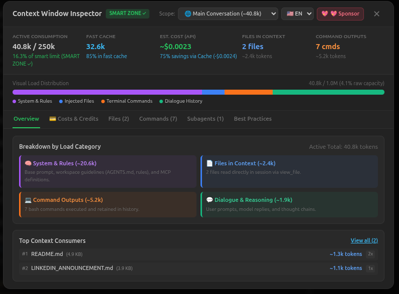
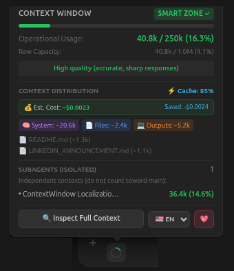
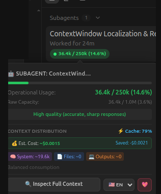

<div align="center">

# 🛸 Antigravity Context Window Monitor

**Real-time context gauge, subagent inspector & cost estimator for Google Antigravity.**

[](LICENSE)
[](package.json)
[](package.json)
[](#-native-internationalization-7-languages)
[](https://github.com/sponsors/vitalfin)

<br/>



<br/>

<p align="center">
  
  &nbsp;&nbsp;
  
</p>

</div>

---

## 📖 Overview

When developing with state-of-the-art LLMs (Gemini 3.8 Flash, Gemini 3.1 Pro, Claude Sonnet 4.6) in **Google Antigravity**, context window bloat is the primary cause of hallucinations, instruction loss, and high latency.

While modern LLMs accept 1M+ tokens, fine-grained reasoning and needle-in-a-haystack recall degrade sharply above **250k tokens**. 

**Antigravity Context Window Monitor** is a lightweight, non-intrusive runtime monitor that attaches to your Antigravity IDE session via Chrome DevTools Protocol (CDP). It provides instant visual observability, token distribution breakdown, automated compaction tracking, and live API cost estimation.

---

## 🚀 Quick Start

### Prerequisites
- Node.js >= 18.0.0
- Google Antigravity IDE running on Linux, macOS, or Windows

### 1. Clone & Run

```bash
git clone https://github.com/vitalfin/antigravity-context-monitor.git
cd antigravity-context-monitor
npm start
```

The daemon automatically detects Antigravity's active CDP port across Linux (`~/.config/Antigravity/DevToolsActivePort`), macOS (`~/Library/Application Support/Antigravity/DevToolsActivePort`), and Windows (`%APPDATA%\Antigravity\DevToolsActivePort`), and injects the monitor in real time.

### 2. Optional: Run as Linux Background Service (systemd)

To keep the monitor running automatically in the background on Linux:

```bash
mkdir -p ~/.config/systemd/user
cat << 'EOF' > ~/.config/systemd/user/antigravity-context-monitor.service
[Unit]
Description=Antigravity Context Window Monitor (Linux)
After=graphical-session.target

[Service]
Type=simple
ExecStart=/usr/bin/env node /home/ph/projects/vitalf/code/workspace/antigravity-context-monitor/monitor.mjs
Restart=always
RestartSec=3

[Install]
WantedBy=default.target
EOF

systemctl --user daemon-reload
systemctl --user enable --now antigravity-context-monitor.service
```

---

## 🎯 The Operating Zones

The monitor benchmarks token volume against cognitive fidelity thresholds:

| Zone | Operational Usage | Status | Impact on Model Reasoning |
| :--- | :---: | :---: | :--- |
| 🟢 **SMART ZONE** | `0% - 40%` (< 100k) | **Optimal ✓** | Peak attention, zero hallucinations, fast response times. |
| 🟡 **WARNING ZONE** | `40% - 60%` (100k - 250k) | **Degrading ⚠️** | Noticeable attention loss. Delegate tasks to Subagents. |
| 🔴 **DUMB ZONE** | `> 60%` (> 250k) | **Critical ✗** | High risk of instruction neglect. Start a fresh conversation. |

---

## ✨ Key Features

- **Dynamic Dual Ring Widget**: Minimalist SVG circular ring next to the prompt input bar, synchronized with a breadcrumb widget at the top.
- **🛡️ Subagent Context Isolation**: Dedicated tracking for subagents. Subagent tokens are isolated and never conflated with the main conversation.
- **🔄 Compaction Tracking**: Detects Antigravity history compacting events (`🔄 1x`, `🔄 2x`) while accurately maintaining post-compaction context tracking.
- **💳 API Cost & Cache Savings**: Market-rate estimations for Gemini and Claude models, showing up to 90% savings generated by Gemini Context Caching.
- **🔍 Full Inspector Modal**: 6 detailed inspection tabs (Overview, Costs & Credits, Files, Commands, Subagents, and Best Practices).
- **🌐 Native Internationalization (7 Languages)**: Defaults to English (`en`), with instant runtime switching to Portuguese (`pt`), Spanish (`es`), Japanese (`ja`), Chinese (`zh`), French (`fr`), and German (`de`).

---

## 🧪 Testing

```bash
# Run unit tests (i18n key symmetry & pricing algorithms)
npm test

# Run live CDP browser tests against active Antigravity IDE
npm run test:cdp

# Run full test suite
npm run test:all
```

---

## 💖 Sponsorship & Support

Maintained with care by **Vitalf Technologies** to empower autonomous AI engineering. If this tool helps your workflow, consider supporting our open-source development:

👉 **[Sponsor Vitalf Technologies on GitHub](https://github.com/sponsors/vitalfin)**

---

## 📄 License

Distributed under the **MIT License**.

You are free to use, modify, distribute, and sublicense this software, provided that the original copyright notice and permission notice attributing **Vitalf Technologies** are retained in all copies or substantial portions of the Software. See [LICENSE](LICENSE) for full details.
